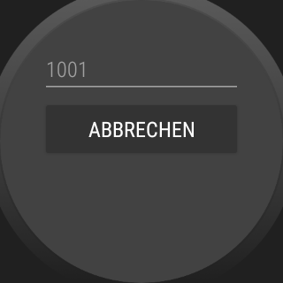

# WearOS-App "Lange Berechnung"

The repository contains an *Android Studio project* with a WearOS app that shows how to perform long operations (example here: long calculation) in a background thread.

 

This app is a variation of the Android app [Langlaufende Operationen](https://github.com/MDecker-MobileComputing/Android_LanglaufendeOperationen).

 

Identifiers (names for classes, variables and methods), (JavaDoc) comments and UI texts are in German only.

 

----

## Screenshots

    

 

    

 

----
# License

See the [LICENSE file](LICENSE.md) for license rights and limitations (BSD 3-Clause License).
